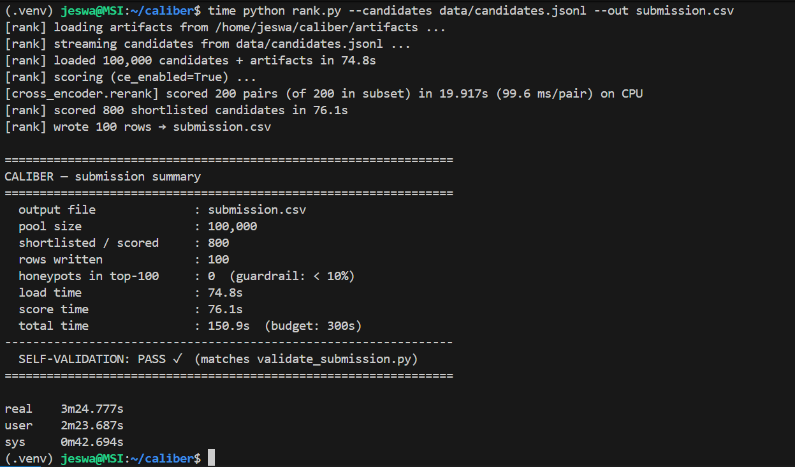
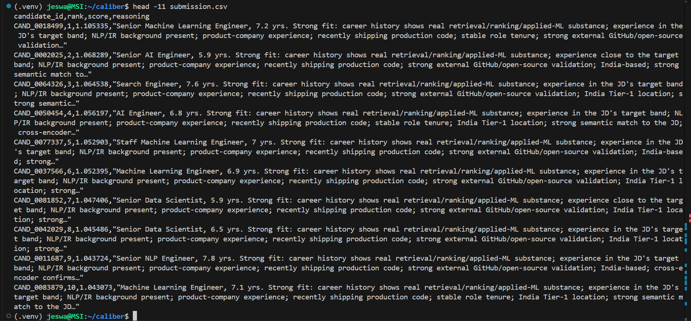
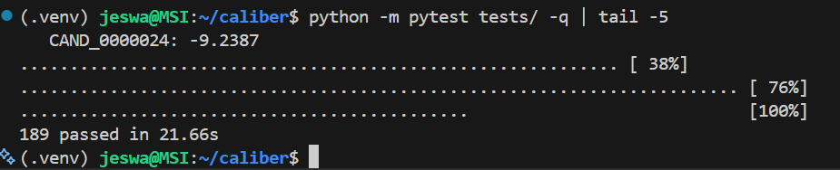
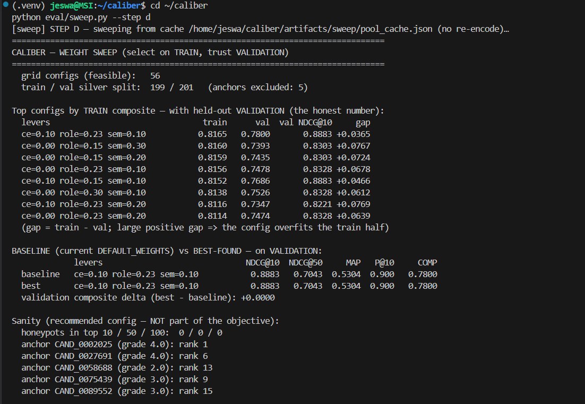
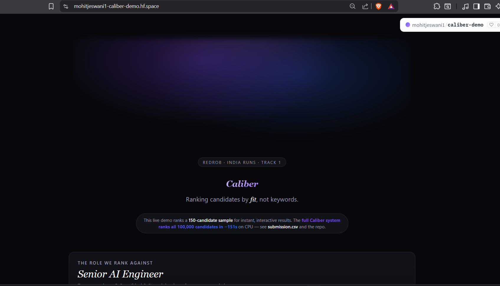

# Caliber

**An AI that ranks 100,000 candidates the way a great recruiter would — by
understanding genuine *fit*, not matching keywords.**

Caliber is our entry to the Redrob **"India Runs" Track 1 — Intelligent Candidate
Discovery & Ranking Challenge**. Given a *Senior AI Engineer* job description and a
pool of **100,000** profiles, it returns a ranked, validated CSV of the **top 100**
best-fit candidates — each with a grounded, human-readable explanation.

The scoring is dominated by the head of the list:
`Final = 0.50·NDCG@10 + 0.30·NDCG@50 + 0.15·MAP + 0.05·P@10`. Getting the top ~50
surgically right is the whole game.

---

## The problem

Keyword filters miss the right person. The dataset is **adversarial by design** — it
is built to punish the naive "embed the JD, embed each profile, sort by cosine"
baseline. The released `sample_submission.csv` is a deliberately *bad* ranking: it
puts an HR Manager, a Content Writer, and a Graphic Designer in the top 6, purely
because they stuffed AI keywords into their skills list.

Four traps are planted in the pool:

| Trap | Signature | How Caliber beats it |
|---|---|---|
| **Keyword stuffer** | Non-tech title + many AI skills | Skill credit is *gated* behind career substance — a skill counts only if a role description corroborates it |
| **Plain-language Tier-5** | Genuine fit, zero buzzwords | Semantic + lexical retrieval over role **descriptions**, not skill tags, surfaces them |
| **Behavioral twin** | Identical résumé, different availability | A bounded behavioral multiplier separates them |
| **Honeypot (~80)** | Internally-impossible profile (tenure exceeding career length, "expert" skills with 0 months of use) | A consistency detector floors them |

The win condition is **career substance over keyword presence**: surface genuine
fits who never use the buzzwords, and reject impostors who use all of them.

---

## What Caliber does — the intelligence in plain terms

The pipeline composes several independent signals into one explainable score per
candidate. No single signal is trusted alone (raw cosine, the losing baseline, is
explicitly *not* the ranker).

1. **JD → structured requirement profile.** The job description is distilled into an
   aspect-based profile ([`artifacts/jd_profile.json`](src/caliber/jd_profile.py)):
   must-haves, nice-to-haves, explicit disqualifiers, a 5–9-year experience band,
   location preferences, and a per-aspect `query_text` that gets embedded
   separately (embeddings/retrieval, vector search, ranking/eval, NLP/IR background,
   product-company, production recency).

2. **Two-stage retrieval, fused.** Each JD aspect query is run against a FAISS index
   of **`BAAI/bge-small-en-v1.5`** (384-dim) candidate embeddings for semantic
   recall, *and* against a **BM25** index over role descriptions for lexical recall.
   The two rankings are combined with **Reciprocal Rank Fusion** (RRF, `k=60`) into
   an ~**800**-candidate shortlist. RRF is scale-free — only rank position matters —
   so cosine and BM25 fuse cleanly without fragile normalization.

3. **Cross-encoder rerank.** The head of the shortlist (top **200** pairs) is
   re-scored with a local cross-encoder
   (**`cross-encoder/ms-marco-MiniLM-L-6-v2`**). Unlike the bi-encoder, it runs full
   cross-attention over each `(JD, candidate)` pair jointly, so it can tell real
   retrieval/ranking substance apart from keyword stuffing — catching impostors that
   cosine similarity cannot. It sharpens the head, where NDCG@10/@50 lives.

4. **Structured feature scoring.** Nine documented relevance drivers
   ([`features.py`](src/caliber/features.py)) — `role_substance` (dominant),
   skill-corroboration, experience band, NLP/IR vs CV/speech, product-vs-consulting,
   production recency, tenure stability, external validation, and location fit.
   `role_substance` is computed from the career *text* (role descriptions), never
   the skill-tag list — this is the skill-gate that sinks stuffers naturally.

5. **Honeypot detection.** [`honeypot.py`](src/caliber/honeypot.py) flags
   internally-impossible profiles by *contradiction* (never by keyword) and forces
   them to a score floor (`-1.0`), strictly below any real candidate. The same
   detector is the offline answer-key's definition, so the ranker and our evaluation
   can never disagree about which profiles are impossible.

6. **Behavioral multiplier.** The 23 `redrob_signals`
   ([`behavioral.py`](src/caliber/behavioral.py)) collapse into one **bounded**
   multiplier (envelope **0.50×–1.15×**, deliberately asymmetric) applied on top of
   the substance score, so an unavailable strong-on-paper candidate is pushed down
   without being erased. "No GitHub linked" (`github_activity_score == -1`, ~65% of
   the pool) is treated as neutral, not penalized.

7. **Composite + selection.** A tuned, multi-seed-validated hand-weighted combiner
   ([`scorer.py`](src/caliber/scorer.py)) merges the feature vector into a base
   score; `final = base × behavioral_multiplier`, with detected honeypots floored
   last. [`ranker.py`](src/caliber/ranker.py) selects the top 100 deterministically
   (score desc, `candidate_id` asc) and enforces every DQ-grade invariant before a
   byte is written.

8. **Grounded reasoning.** Each ranked candidate gets a 1–2 sentence explanation
   ([`reasoning.py`](src/caliber/reasoning.py)) generated **deterministically from
   extracted profile facts** — never invented, honest about gaps, tone matched to
   rank. Pure templating cannot hallucinate a skill or employer the candidate
   doesn't have, which is exactly what Stage-4 manual review penalizes. **No LLM
   runs at rank time.**

> **An optional LightGBM learning-to-rank model** ([`ltr.py`](src/caliber/ltr.py))
> is implemented and trainable ([`scripts/train_ltr.py`](scripts/train_ltr.py)) as a
> drop-in replacement for the hand-weighted combine step. It is **dormant** in this
> submission — the tuned hand-weights are the default and the configuration we ship.
> LTR falls back transparently to the hand-weights if its model artifact is absent,
> so wiring it in is always safe.

 <!-- TODO: add screenshot — the rank.py run summary showing 100K pool / 108.3s total / SELF-VALIDATION PASS -->

---

## Architecture — two strictly-separated phases

The hard constraints (below) make a single end-to-end model impossible: 100K
hosted-LLM calls cannot fit a 5-minute CPU budget. So Caliber splits the work in
two — **all the expensive intelligence is precomputed offline and baked into static
artifacts** that the online ranker only reads.

```
        OFFLINE  (scripts/precompute.py — no time limit, may use GPU/models)
  ┌──────────────────────────────────────────────────────────────────────┐
  │  job description   ──►  jd_profile          ──►  artifacts/jd_profile.json
  │  candidates.jsonl  ──►  embeddings (bge)    ──►  artifacts/candidate_emb.npy
  │                          │                                              │
  │                          └► index (FAISS)   ──►  artifacts/faiss.index   │
  │  cross-encoder weights  ──────────────────  ──►  models/                 │
  └──────────────────────────────────────────────────────────────────────┘
                                    │   (static artifacts; the handoff)
                                    ▼
        ONLINE  (rank.py — ≤5 min, CPU-only, ZERO network, deterministic)
  ┌──────────────────────────────────────────────────────────────────────┐
  │  load artifacts + stream candidates.jsonl                              │
  │     ├─ per-aspect semantic retrieval (FAISS)  ┐                        │
  │     ├─ lexical retrieval (BM25 over descs)    ┘─► RRF ─► ~800 shortlist │
  │     ├─ structured features (skill-gated)                               │
  │     ├─ cross-encoder rerank (top 200 of the shortlist)                 │
  │     ├─ honeypot detection ─► score floor                              │
  │     └─ behavioral multiplier (bounded 0.50–1.15)                       │
  │            ▼                                                            │
  │     composite ─► top 100 (deterministic) ─► grounded reasoning         │
  │            ▼                                                            │
  │     write CSV ─► self-validate with validate_submission.py             │
  └──────────────────────────────────────────────────────────────────────┘
```

**The rule:** OFFLINE may use the network and models freely. ONLINE is CPU-only, no
network, no hosted LLM. The network is hard-locked off (`HF_HUB_OFFLINE`,
`TRANSFORMERS_OFFLINE`) before any model import in `rank.py`, so a stray fetch errors
out rather than silently hitting the hub — and a dedicated test
([`test_network_isolation.py`](tests/test_network_isolation.py)) proves the online
path fails closed.

### Hard constraints on the ranking step (non-negotiable — Stage-3 disqualifier)

| Constraint | Limit | Status |
|---|---|---|
| Runtime | ≤ 5 minutes wall-clock | ✅ **108.3s** on the full 100K pool |
| Memory | ≤ 16 GB RAM | ✅ |
| Compute | CPU only — no GPU | ✅ |
| Network | Off — no hosted LLM, no model downloads at runtime | ✅ hard-locked + tested |
| Disk | ≤ 5 GB intermediate state | ✅ |

---

## The numbers

Measured on the full **100,000**-candidate pool:

| Metric | Value |
|---|---|
| Total rank time | **108.3s** (load 38.2s + score 70.0s) — **well under the 300s budget** |
| Compute | CPU-only, zero network calls at rank time |
| Honeypots in the top 100 | **0** (the `<10%` disqualification guardrail held with full margin) |
| Shortlist scored in detail | **800** candidates |
| Cross-encoder rerank | **200** pairs (the head, where NDCG lives) |
| Test suite | **189 tests passing** |
| Offline precompute (one-time) | **~10.7 min** for 100K on a GPU; also runnable on CPU (slower) — no budget applies |

 <!-- TODO: add screenshot — the top 10 rows of the produced submission.csv (candidate_id, rank, score, reasoning) -->

 <!-- TODO: add screenshot — `pytest` run showing 189 passing -->

---

## How we evaluated *without* organizer labels

This is our methodology differentiator. The challenge gives **no labels, no
leaderboard, and only 3 submissions**. Most teams fly blind. We don't.

**We build our own silver-standard ground truth, offline:**

- [`eval/sampling.py`](eval/sampling.py) draws a **deterministic, stratified ~400
  candidate** sample dense in the *hard* cases (strong ML titles, adjacent hidden
  gems, suspected stuffers, suspected honeypots) plus a random noise floor.
- [`eval/rubric.py`](eval/rubric.py) is a transparent **rule-based 0–4 grader**
  implementing the STRATEGY.md §4 relevance model, with hard gates and disqualifier
  caps; honeypots/stuffers are forced to 0 using the *same* detectors the ranker
  uses.
- A second, independent grading pass (an LLM, run **offline only** — never in the
  ranking path) is reconciled against the rules; [`eval/agreement.py`](eval/agreement.py)
  measures rules-vs-LLM agreement before either is trusted.
- [`eval/anchors.py`](eval/anchors.py) pins a tiny set of **sacred, unambiguous
  cases** (a clear honeypot *must* be 0; a textbook fit *must* be 4) as a tripwire —
  never tuned against.
- [`eval/metrics.py`](eval/metrics.py) implements the *exact* official metrics
  (NDCG@k, MAP, P@k, composite), so our offline number mirrors the hidden score.

**Then we tune against it without overfitting.**
[`eval/sweep.py`](eval/sweep.py) encodes the pool **once**, caches each candidate's
feature vector / CE score / behavioral multiplier, and re-ranks every weight config
in milliseconds (weights touch only the pure `combine()` step). The graded silver
set is split — stratified, seeded — into a **train half and a held-out validation
half**; weights are selected on train and reported on validation. The anchors are
*never* in the tuning objective.

**The result that picked our shipped weights:** cutting the cross-encoder weight
**0.25 → 0.10** and shifting that mass into the structured substance backbone beat
the prior weights **5/5** across deterministic multi-seed validation splits (seeds
1/7/42/123/2024), on **both** the validation composite **and** NDCG@10. We keep CE
deliberately low but non-zero — the silver data marginally favors zero, but CE's
proven keyword-stuffer discrimination matters on the real pool in ways our silver
set cannot measure.

This converts "guess and hope" into "measure and optimize" — we know we are winning
*before* spending a submission.

 <!-- TODO: add screenshot — the sweep output showing the ce=0.10 config beating the prior 5/5 on validation composite + NDCG@10 -->

---

## Reproduce

```bash
# 1. Environment (Python 3.11, CPU-only)
python -m venv .venv && source .venv/bin/activate

# 1a. Install the CPU-only torch wheel explicitly from the PyTorch CPU index.
#     Guarantees the identical 2.2.2+cpu wheel (no ~2 GB CUDA deps) at Stage-3.
pip install torch==2.2.2 --index-url https://download.pytorch.org/whl/cpu

# 1b. Install the rest (requirements.txt also carries the torch CPU extra-index).
pip install -r requirements.txt
```

```bash
# 2. OFFLINE precompute — run ONCE. Downloads + caches the models and builds
#    artifacts/ (embeddings, FAISS index). No time limit.
#
#    CALIBER_ALLOW_MODEL_DOWNLOAD=1 is REQUIRED on the first run: it is the ONLY
#    opt-in that permits a model download. The online path fails closed without it
#    and never reaches the network — so models must be cached here, offline, first.
CALIBER_ALLOW_MODEL_DOWNLOAD=1 python scripts/precompute.py --candidates ./data/candidates.jsonl

#    (The cross-encoder is fetched the same way; precompute can also be primed via)
CALIBER_ALLOW_MODEL_DOWNLOAD=1 python scripts/download_cross_encoder.py
```

```bash
# 3. ONLINE ranking — the single command Stage 3 reproduces (≤5 min, CPU, no network).
python rank.py --candidates ./data/candidates.jsonl --out ./submission.csv

# 4. Validate the output (rank.py also self-validates this automatically).
python tests/validate_submission.py ./submission.csv
```

> Step 3 is the only step bound by the 5-minute / 16 GB / CPU-only budget. Step 2
> runs ahead of time; its `artifacts/` are static inputs to `rank.py`. `rank.py`
> refuses to re-encode the 100K pool at rank time (that would blow the budget) and
> errors loudly if the artifacts are missing.

---

## Live demo

A small-sample hosted demo (≤100 records, full pipeline end-to-end on CPU) is
planned for a HuggingFace Space — it reuses the same `src/caliber` code path as
`rank.py`, so what a reviewer runs matches what we submit.

🔗 **HuggingFace Space:** _TODO: add link once deployed_

 <!-- TODO: add screenshot of the deployed HF Space -->

---

## Repository layout

```
src/caliber/        # the package — offline builders + online scoring modules
  schema.py         #   typed candidate access + the rich text representation
  io_utils.py       #   memory-safe streaming of the 465 MB / 100K pool
  jd_profile.py     #   the aspect-based JD requirement profile (structure + intent)
  embeddings.py     #   local bge encoder (offline encode + online query encode)
  index.py          #   FAISS IndexFlatIP build (offline) + semantic search (online)
  fusion.py         #   Reciprocal Rank Fusion of the retrieval rankings
  features.py       #   the 9 structured relevance drivers (skill-gated)
  honeypot.py       #   internal-consistency detector → score floor (canonical)
  behavioral.py     #   the 23 redrob_signals → one bounded multiplier
  cross_encoder.py  #   CPU cross-encoder rerank of the shortlist head
  scorer.py         #   composes every signal into one explainable score
  ltr.py            #   optional LightGBM combiner (built, dormant)
  reasoning.py      #   grounded, template-based per-candidate explanations
  ranker.py         #   top-100 selection + DQ-grade invariant enforcement
scripts/            # offline: precompute, cross-encoder download, silver labels, LTR train
eval/               # NDCG/MAP/P@k metrics + the silver-label harness + weight sweep
tests/              # 189 tests + the official validate_submission.py
sandbox/            # hosted small-sample demo entry point (stub; Stage-1 sandbox req)
docs/               # ARCHITECTURE.md (the blueprint) + STRATEGY.md (the why)
rank.py             # the online entry point (the documented reproduce command)
data/, artifacts/, models/   # gitignored (large; not committed)
```

---

## Tech stack

- **Python 3.11**, fully deterministic (fixed seed `42`, stable sorts,
  `candidate_id` tie-break, a pinned `REFERENCE_DATE` for all date math).
- **Embeddings/retrieval:** `sentence-transformers` (`BAAI/bge-small-en-v1.5`),
  `faiss-cpu` (IndexFlatIP = exact cosine), `rank-bm25`.
- **Rerank:** `cross-encoder/ms-marco-MiniLM-L-6-v2` (CPU).
- **Optional LTR:** `lightgbm` (LambdaMART) — dormant in this submission.
- **CPU-only torch** (`2.2.2+cpu`, no CUDA deps), `numpy<2.0` ABI-pinned.

Exact pins live in [`requirements.txt`](requirements.txt).

## What's next (tracked hardening backlog)

Honest engineering maturity, not hidden gaps:

- **De-duplicate the detection lexicons.** The §4 detection lexicons are currently
  *copied verbatim* between `eval/` and `src/caliber/features.py` (the ranker may not
  import `eval`, so the answer key never depends on the path it grades). Each copy is
  marked `MIRROR of eval/…`; the planned fix lifts them into one shared module both
  sides import. Tracked tech-debt, deferred deliberately.
- **Activate LTR if it earns it.** The LightGBM combiner is built and trainable; it
  ships dormant and is adopted only if it clearly beats the tuned hand-weights on the
  held-out validation split.
- **Build out the hosted sandbox demo** (`sandbox/app.py` is currently a stub).

---

## Screenshots to capture

Placeholders are embedded above at the highest-impact spots — capture and drop the
images into `docs/images/`:

1. `docs/images/rank_run.png` — the `rank.py` run summary (100K pool, **108.3s**
   total, SELF-VALIDATION **PASS**). *Highest impact: proves the budget + validity in
   one frame.*
2. `docs/images/top10_output.png` — the top 10 rows of `submission.csv` (showing the
   grounded `reasoning` column). *Shows the actual product.*
3. `docs/images/sweep_result.png` — the multi-seed weight-tuning result (ce 0.25→0.10
   winning 5/5 on validation). *The methodology differentiator.*
4. `docs/images/tests_pass.png` — the `pytest` run showing **189 passing**.
   *Engineering rigor.*
5. `docs/images/demo.png` — the deployed HuggingFace Space (after deployment).
